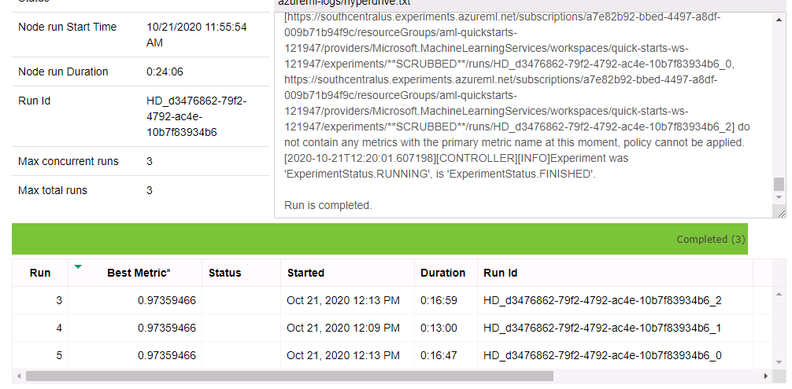

# Azure – Capstone – Deploy the Best Model 

As part of this project, Model Experiments are performed using both HyperDrive and AutoML to identify the best Performing model and Deploy it.

- The Deployed Model End Point is consumed using POST call with data instance in JSON format. The display of score based on the data will signifies the successful deployment of the model for consumption. 

# Project Set Up and Installation

### HyperDrive Setup:

HyperDrive is used to tune the model and parameters we have identified , as part of the HyperDrive run , Parameters are selected for tuning. In this experiments , Random forest Model is selected and parameters such as n_estimators , max_depth are utilized. 
are identified. Initial dataset codes are provided as part of train.py script. And this script is embedded with Estimator and used for HyperDrive Experiments.
If the datascource and pre-processing steps need to be changed , train.py script need to be updated

### AutoMl Setup:
AS part of autoMl setup , autoMl config is updated with the task type , training data and other relevant parameters for experiments.  Experiment run will trigger experimentation with various models and best model will be recommended by autoML , which can be registered and deployed 

### Deployment Procedure 

As part of the deployment , the best model from AutoMl is identified and deployed. For Deployment set of steps need to be followed
-	Save and Register the best model
-	Configure the Score.py file which consist of init and run for initializing the registered model and running it as part of consumption
-	Environment details
-	Inference config , where we need to provide entry script and environment
-	Micro service setup
-	Model deployment 

### Status will be provided based on deployment of the model , we can also check that in the Azure Ml Studio to check the deployment 

**In this Screen shot , we can observe that the best model is deployed successfully and the deployment status is “Healthy”**

# Dataset

## Overview

The raw network packets of the UNSW-NB 15 data set is created by the IXIA PerfectStorm tool in the Cyber Range Lab of the Australian Centre for Cyber Security (ACCS) for generating a hybrid of real modern normal activities and synthetic contemporary attack behaviours.

Tcpdump tool is utilised to capture 100 GB of the raw traffic (e.g., Pcap files).

Source of Dataset – [UNSW-NB 15 data set]( https://www.unsw.adfa.edu.au/unsw-canberra-cyber/cybersecurity/ADFA-NB15-Datasets/a%20part%20of%20training%20and%20testing%20set/UNSW_NB15_training-set.csv)

In this dataset , we can find various online transaction signatures. These features can be used to identify whether a transaction is a fraudulent transaction or Normal Transaction 

## Task

We will be using machine learning models to classify whether a transaction is a Normal Transaction or Fraudulent transactions

**Task**- Classification problem as we are classifying based on features into Normal or Fraudulent Transaction 

There are more than 45 features as part of the dataset, which has wide range of information of network transformation and attack classifications. 

Feature Descriptions are provided in the link below,

https://www.unsw.adfa.edu.au/unsw-canberra-cyber/cybersecurity/ADFA-NB15-Datasets/NUSW-NB15_features.csv

Target – “label” with values as 1 – for Fraudulent Transaction and 0 – for Normal Transaction is used as Target

## Access 

The data is access using the following URL
https://www.unsw.adfa.edu.au/unsw-canberra-cyber/cybersecurity/ADFA-NB15-Datasets/a%20part%20of%20training%20and%20testing%20set/UNSW_NB15_training-set.csv

### TabularDatasetFactory Azure API is used to fetch the data directly from the URL and stored it in Azure environment
Screenshot below

# Automated ML

## Overview

As part of autoMl Experiment , we expect the autoML framework to recommend the best model for the task and the dataset provided. 
AutoConfiq setup is provided. Where the task is set as Classification , as shown below

And the experiment is submitted.

## Results

AutoML has recommended model with higher accuracy compared to the HyperDrive Experiments. 

### Model Identified : 
After the completion of  experiments, AutoML has shown better performance with Balanced Accuracy of close to 99 % 

Model identified by the AutoML – Light GBM Classifier

Important Parameters:

N_estimators = 100
Learning Rate = 0.1

### About the model : LightGBM Classifier
LightGBM is a gradient boosting framework that uses tree based learning algorithms. It is designed to be distributed and efficient with the following advantages:

Faster training speed and higher efficiency.

Lower memory usage.

Better accuracy.

Support of parallel and GPU learning.

Capable of handling large-scale data.

### Hyper parameter recommended :

-	**n_estimators** at 100 is a optimal range of estimators for the dataset configurations ,   since Light GBM is a tree based model , n_estimators act as number of trees of ensemble model which have help us to reduce overfit while model training
-	**Learning Rate** at 0.1 , is optimal and not too low for the model training process
-	**num_leaves** which signifies the max number of leaves in one tree is recommended at 31. 

## Experiment results – AutoML Run Widget
Below are the Run Widget screens shots of the AutoMl experiments ,

# Hyperparameter Tuning – HyperDrive

As part of HyperDrive model experiments , Random Forest Classifier model from Scikit learn package is used for Hyper parameter fine tuning

-	Random Forest is a tree based model , is best suited for dataset with wide number of features. 
-	Since it is ensemble model , it can help us to reduce model bias and variance and the experiment is conducted to identify the optimal values for two important Hyper Parameters

N_estimator : The number of trees in the forest. This parameter will help us to train the model better and is based on number of features (approximate) 

Range is set as 60 , 70 , 100 , so that a optimal n_estimator is recommended by the Random Sampling method

Max_depth - The maximum depth of the tree. If None, then nodes are expanded until all leaves are pure or until all leaves contain less than min_samples_split samples.

As a accepted rule optimal range lies between 5 to 7 , there is the range for experiment is set as 5  , 6, 7 
Random Sampling method is selected because of reducing the time taken for identifying the best hyper parameter. This method also has best time to performance ratio compared to Grid Search method. can also help us to experiment with different Hyper Parameters
Early Stopping Policy
Bandit Policy: Objective for selecting this Policy is to avoid unwanted iterations in the experiments when a best param is identified. Bandit policy is based on slack factor/slack amount and evaluation interval. Bandit terminates runs where the primary metric is not within the specified slack factor/slack amount compared to the best performing run.

## Results

The performance of the HyperDrive model is good and recommend Hyper paramters which provide a accuracy close to 97%.

Best Param recommendations
**['--max_depth', '5', '--n_estimators', '60']**

Max_depth – is at 5

The maximum depth of the tree. If None, then nodes are expanded until all leaves are pure or until all leaves contain less than min_samples_split samples.

N_estimator – 60
The number of trees in the forest. This parameter will help us to train the model better and is based on number of features (approximate)

### Hyper Drive best model is registered

# Model Deployment
From the experiements , we can clearly observe that AutoMl has recommened the best model.
Therefore , Best model from the AutoML experiment is deployed by following procedure

-	Best model from AutoML is registered

-	Score.py file is configured. This file is important for initializing the registered model with the path and using it to run predictions

-	Necessary configurations such as Environment details are provided along with Inference config , where we need to provide entry script and environment
-	Micro service setup is provided

### Consumption of the model 
The Deployed Model End Point is consumed using POST call with data instance in JSON format. The display of score based on the data will signifies the successful deployment of the model for consumption.

Deployed Model view in Azure Ml Studio

# Screen Recording

Link to Screen Cast 

https://www.youtube.com/watch?v=RQU6pTzhXog
